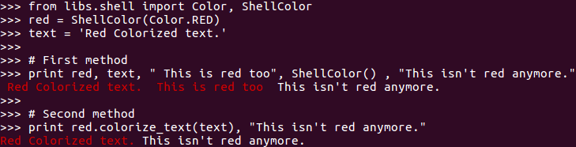
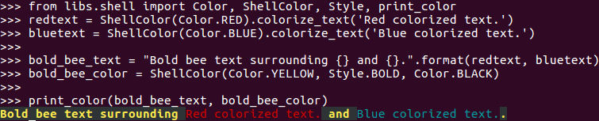

This is a little python module that aim to make writting in color in a terminal 
easier for unix users.

The underlying mechanism is ANSI coloring. For more details on ANSI
coloring see : https://en.wikipedia.org/wiki/ANSI_escape_code 

# Creating a ShellColor

~~~~
# No style, no text color, no font color
default = ShellColor()

# Text style is bold, font color is black
bold_black =  ShellColor(
    font_color=Color.BLACK,
    text_style=Style.BOLD,
)

# Text color is yellow, text style is bold, font color is black
bold_bee = ShellColor(Color.YELLOW, Style.BOLD, Color.BLACK)
~~~~

## Available color

NONE, BLACK, RED, GREEN, YELLOW, NAVY, PURPLE, BLUE, WHITE

## Available style

NONE, BOLD, LIGHT, UNDERLINE, BLINK, INVERSE, HIDDEN

# Creating an ANSI colored string and printing it

## Code
~~~~
from libs.shell import Color, ShellColor
red = ShellColor(Color.RED)
text = 'Red Colorized text.'

# First method
print red, text, " This is red too", ShellColor() , "This isn't red anymore."

# Second method
print red.colorize_text(text), "This isn't red anymore."
~~~~

## Result

# Using the 'print_color' function

## Code
~~~~
from libs.shell import Color, ShellColor, Style, print_color
redtext = ShellColor(Color.RED).colorize_text('Red colorized text.')
bluetext = ShellColor(Color.BLUE).colorize_text('Blue colorized text.')

bold_bee_text = "Bold bee text surrounding {} and {}.".format(redtext, bluetext)
bold_bee_color = ShellColor(Color.YELLOW, Style.BOLD, Color.BLACK)

print_color(bold_bee_text, bold_bee_color)
~~~~

## Result

# History

It was used first inside a django project alongside a logging configuration so
various logging levels were easily distinguishables. It still has a dependancie
with django for tests and django jenkins for style, so it need refactoring. :)
